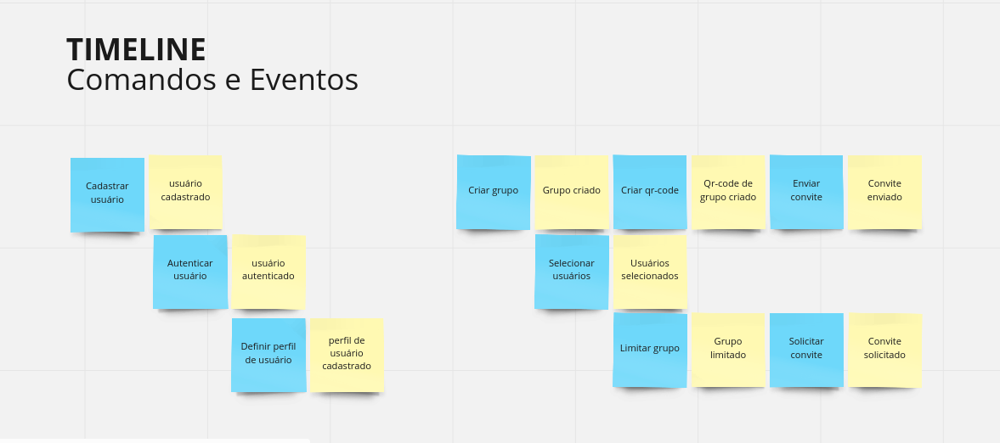
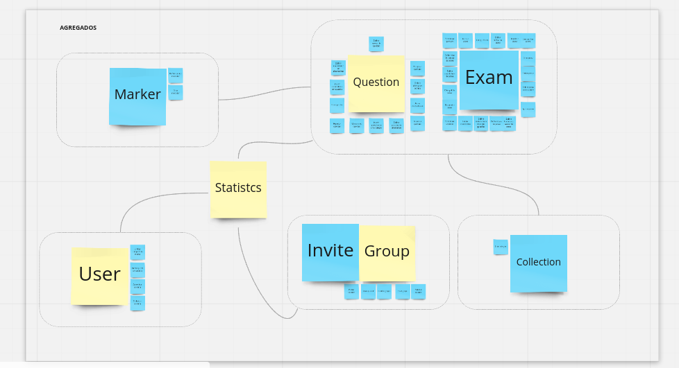

# Unio 

> An **open source** application that aims to automate the performance of online exams.

- You will be able to search the immense collection of questions from numerous universities.
- You will be able to create your own simulation for studies.

>You can check **event storming**

[Miro url](https://miro.com/welcomeonboard/ciQxDcPTuFFGb3jWfr3gNl6gafV2GIHs3Qdr48z69mNa7XQLZCI6IbY8r3PG8PZ3)

---

---

#### Graph Database 
We are using graph database

Also using domain driving desing, typescript and nestjs

> Join us and contribute to the project